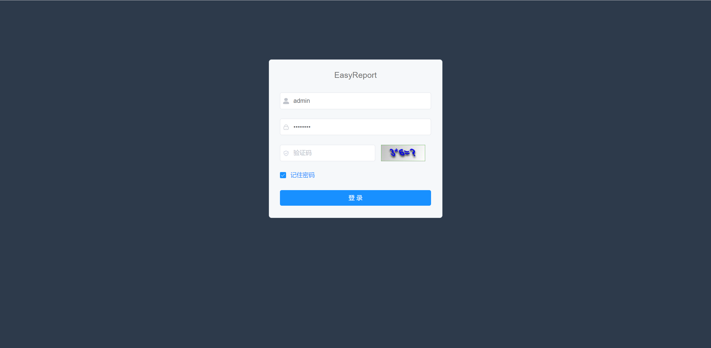
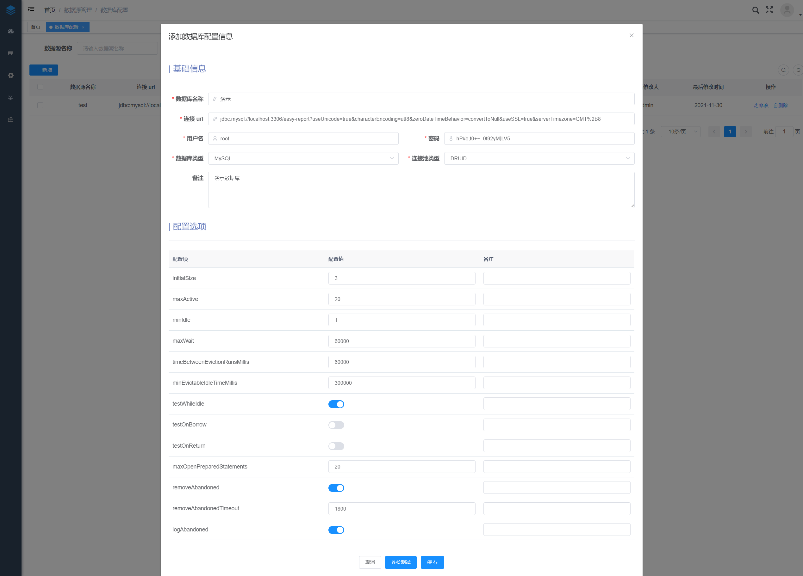
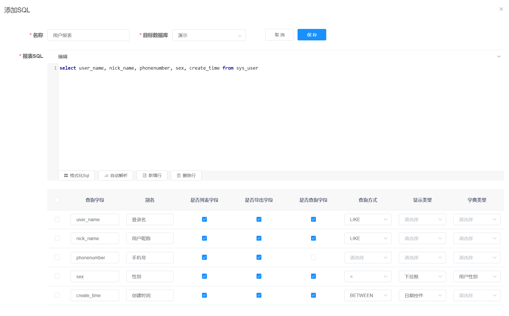
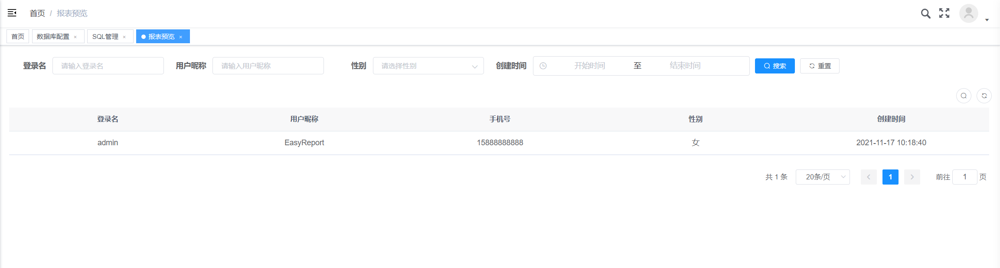
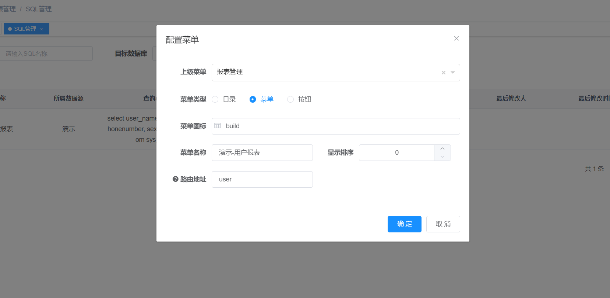
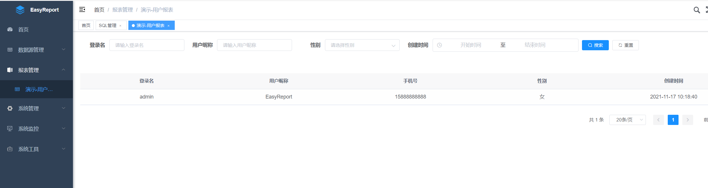

# EasyReport
---

EasyReport 是一款比较简单的在线 Web 报表工具，也算是一个种子项目，本身是基于[若依](http://ruoyi.vip/ )的前后端分离版本（SpringBoot + Vue）开发的，核心功能就是通过配置数据源和查询 SQL 来动态配置和生成报表（Table），并且可以针对不用的角色或者用户来配置各自的报表查看权限。

>  目前开源版本只保留了最基本的功能，适合一些比较简单的数据查询统计，实际使用过程还需要根据自身业务来进行二次开发。

* [EasyReport](#easyreport)
  * [背景](#背景)
  * [准备工作](#准备工作)
  * [后端](#后端)
  * [前端](#前端)
  * [使用说明](#使用说明)
    * [登录](#登录)
    * [配置数据库](#配置数据库)
    * [SQL 管理](#sql-管理)
      * [添加SQL](#添加sql)
      * [报表预览](#报表预览)
      * [添加菜单](#添加菜单)
      * [查看报表](#查看报表)
  * [其他](#其他)

## 背景

`EasyReport` 最开始是因为公司内业务方向比较多，业务部门对数据的统计维度各不一样，业务初期我们技术同学一般定期通过 SQL 查出数据复制粘贴到 Excel 中再发给业务同事，后来为了方便业务同事实时查看，也不用再每次去麻烦技术同学，就做了这个通过配置数据源和查询 SQL 动态生成在线报表的工具，总的来说还是挺方便的。

## 准备工作

```java
JDK >= 1.8 (推荐1.8版本)
Mysql >= 5.7.0 (推荐5.7版本)
Redis >= 3.0
Maven >= 3.0
Node >= 10
```

> 安装部署可以直接参考若依的官方文档

## 后端

1. 导入到`IntelliJ IDEA`，菜单 `File` -> `Open`，选择 EasyReport 项目目录，等待自动加载 `Maven` 依赖包，初次加载会比较慢（根据自身网络情况而定）
2. 创建数据库 `easy-report` 并导入数据脚本 `docs/db/er_2021xxxx.sql`
3. 打开项目运行 `com.sdyx.com.sdyx.java`

## 前端

```
# 进入项目目录
cd easy-report-ui

# 安装依赖
npm install

# 强烈建议不要用直接使用 cnpm 安装，会有各种诡异的 bug，可以通过重新指定 registry 来解决 npm 安装速度慢的问题。
npm install --registry=https://registry.npm.taobao.org

# 本地开发 启动项目
npm run dev
```

## 使用说明

> 系统管理员：admin/admin123

### 登录

- 用户名：admin	|	密码：admin123



### 配置数据库

> 数据源管理 -> 数据库配置 -> 新增

输入正确的数据库配置信息，点击连接测试，提示连接成功后可保存当前数据源



### SQL 管理

> 数据源管理 -> SQL 管理 -> 新增

#### 添加SQL

- 选择上述配置好的数据源，编辑报表查询SQL

- 自动解析，解析出报表字段

- 对报表字段进行配置，这里我们选择查询用户表作为显示，其中 user_name、nick_name 字段使用模糊查询，sex 选择使用字典作为下拉框选项（字典可在后台进行动态配置和管理），create_time 选择使用日期控件进行范围查询

- 配置完成后点击保存



#### 报表预览

点击报表预览，可以查看新增报表功能是否正常




#### 添加菜单

在 sql管理 列表，我们可以很方便的将当前报表配置为左侧菜单（当然也可以在系统管理-菜单管理里面自主配置）



#### 查看报表

将报表SQL配置为菜单后，刷新页面可查看新配置的报表



## 其他

- 欢迎提出改进意见
- 学习交流vx：Dev_Zwd

